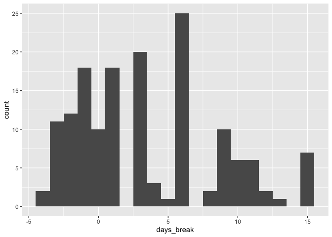
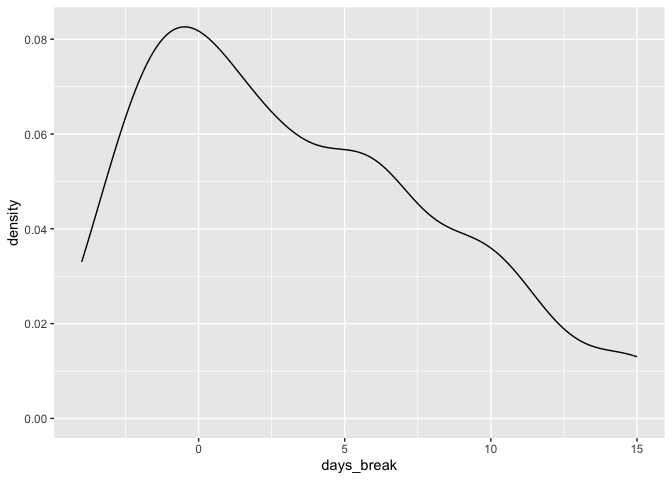
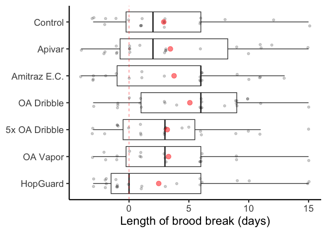

# Setup


```r
library(tidyverse)
```

```
## ── Attaching packages ─────────────────────────────────────── tidyverse 1.3.2 ──
## ✔ ggplot2 3.4.1     ✔ purrr   1.0.1
## ✔ tibble  3.1.8     ✔ dplyr   1.1.0
## ✔ tidyr   1.3.0     ✔ stringr 1.5.0
## ✔ readr   2.1.4     ✔ forcats 1.0.0
## ── Conflicts ────────────────────────────────────────── tidyverse_conflicts() ──
## ✖ dplyr::filter() masks stats::filter()
## ✖ dplyr::lag()    masks stats::lag()
```

```r
library(lme4)
```

```
## Loading required package: Matrix
## 
## Attaching package: 'Matrix'
## 
## The following objects are masked from 'package:tidyr':
## 
##     expand, pack, unpack
```

```r
library(car)
```

```
## Loading required package: carData
## 
## Attaching package: 'car'
## 
## The following object is masked from 'package:dplyr':
## 
##     recode
## 
## The following object is masked from 'package:purrr':
## 
##     some
```

# Read in data


```r
an_dat <- read.csv("./data_prepared/an_dat.csv")

an_dat <- an_dat %>%
  mutate(trt_label = fct_relevel(trt_label, "Control", "Apivar", "Amitraz E.C.", "OA Dribble",  "5x OA Dribble","OA Vapor", "HopGuard"))
```

# Queen establishment success Y/N

Criterion: did they begin laying worker eggs by Day 30?
- If not by that time we culled them

Data to use: all
- For other variables that relate to colony development over time, we exclude colonies that ever developed EFB
- Since this is a short-term measure, we can include these EFB colonies
- First time EFB was observed was d44
- What time frame to look at...

Dates to look at
- Day 30 data is the most key... 
- Simplistically we could just look and see were they QR on day 30 or not?
- But a few colonies had young brood on day 30, so we can't necessarily tell yet if they are drone layers - so let's also look at day 44 data
- It is only ambiguous if the brood age was L3 or lower on day 30
  - L3 on day 30 corresponds to anything with a layday of 24 or higher


```r
# Exploring how to assess 

an_dat %>% 
  filter(start_layday <= 23)
  # Of the 138 colonies that had a layday of 23 or lower, all were QR/QS on d30 and none were DL on d44

# All colonies whose queens started laying on day 23 or before, did successfully lay worker eggs


an_dat %>% 
  filter(start_layday >= 24) 
  # Of the 27 colonies that had a layday of 24 or higher...
an_dat %>% 
  filter(start_layday >= 24) %>% 
  filter(ch44_qstatus == "DL")
  # ...8 were DL on d44
```

Refined criterion:
- Laying worker brood on day 30 (only able to asses for layday <=23)
- If start_layday >=24, then consider established if QR/QS at ch44_qstatus

## Determine which queens successfully established

```r
# names(an_dat)

# Make a manageable dataset
establish_dat <- an_dat %>% 
  select(colony_num,
         new_yard,
         trt_label,
         ch18_eggs,
         ch18_qstatus,
         ch18_ageoldest,
         ch30_eggs,
         ch30_qstatus,
         ch30_ageoldest,
         ch44_eggs,
         ch44_qstatus,
         start_layday
         )

# Success column means "did they ever lay worker eggs"
establish_dat$success <- "NA"

# Nested ifelse to implement criterion
establish_dat <- establish_dat %>% 
  mutate(
    success = ifelse(ch30_qstatus %in% c("QR", "QS") & start_layday <= 23, "Y", 
                     ifelse(start_layday >= 24 & ch44_qstatus %in% c("QR", "QS"), "Y", "N"))
  )
```


## Summarize what proportion of queens successfully established
- Per treatment
- Overall


```r
# Overall
establish_dat %>% 
  group_by(success) %>% 
  summarise(n = n()) %>% 
  spread(success, n)
```

```
## # A tibble: 1 × 2
##       N     Y
##   <int> <int>
## 1    23   154
```

```r
# Overall, 23 failed and 154/177 successfully established

success_all_tab <- data.frame(trt_label = "All", Y = 154, N=23)


# By treatment
success_trt_tab <- establish_dat %>% 
  group_by(trt_label, success) %>% 
  summarise(n = n()) %>% 
  spread(success, n) %>% 
  ungroup()
```

```
## `summarise()` has grouped output by 'trt_label'. You can override using the
## `.groups` argument.
```

```r
success_trt_tab <- success_trt_tab %>% 
  mutate(N = ifelse(is.na(N), 0, N)) %>% 
  select(trt_label, Y, N)

success_tab <- rbind(success_all_tab, success_trt_tab)

# Set the order it will print in
success_tab <- success_tab %>%
  mutate(trt_label = fct_relevel(trt_label, "All", "Control", "Apivar", "Amitraz E.C.", "OA Dribble",  "5x OA Dribble","OA Vapor", "HopGuard"))

success_tab <- success_tab %>% 
  mutate(total = Y + N,
         perc = 100*Y/total
         )

success_tab %>% 
  arrange(trt_label)
```

```
##       trt_label   Y  N total      perc
## 1           All 154 23   177  87.00565
## 2       Control  20  5    25  80.00000
## 3        Apivar  22  3    25  88.00000
## 4  Amitraz E.C.  21  5    26  80.76923
## 5    OA Dribble  25  0    25 100.00000
## 6 5x OA Dribble  23  2    25  92.00000
## 7      OA Vapor  20  5    25  80.00000
## 8      HopGuard  23  3    26  88.46154
```

There's no need to statistically analyze this. There's no biological basis to hypothesize that treatments would increase the establishment success of queens.

There is biological basis to hypothesize that treatments might harm queens, thus decreasing establishment success.

No treatment had lower success than Control, so we just state that there was no indication that any treatment lowered establishment success.


# Determine length of brood break for each colony


```r
# It's only sensible to look at the length of brood break for colonies which DID successfully establish. Thus filter to success = "Y"

# A worker brood cell becomes receptive to Varroa on day 8, and emerges on day 21

break_dat <- establish_dat %>% 
  filter(success == "Y") %>% 
  select(colony_num, trt_label, start_layday) %>% 
  mutate(age_start_lay = start_layday - 2,
          emerge_day = 21,
         receptive_day = start_layday + 8,
         days_break = receptive_day - emerge_day,
         completeYN = ifelse(days_break > 0, "Complete", "Not Complete"),
         completeYN = fct_relevel(completeYN, "Not Complete", "Complete")
         )

# Some basic plots to visualize data
break_dat %>% 
  ggplot(aes(x=days_break)) +
  geom_histogram(binwidth = 1)
```

<!-- -->

```r
break_dat %>% 
  ggplot(aes(x=days_break)) +
  geom_density()
```

<!-- -->

```r
break_dat %>%
  ggplot(aes(y=trt_label, x=days_break)) +
  geom_violin()
```

<!-- -->

```r
# Working on a final figure

## Graph option 1 - preferred
break_dat %>%
  ggplot(aes(x=trt_label, y=days_break)) + # Length of brood break
  geom_boxplot(outlier.shape = NA) +
  geom_hline(yintercept = 0, color = "red", linetype = "dashed", alpha = 0.5) +
  geom_jitter(alpha=0.2, width = 0.2, height = 0.1) +
  stat_summary(fun.y=mean, geom="point", shape=20, size=5, alpha = 0.5, color = "red") +
  scale_x_discrete(limits = rev) +
  ylab("Length of brood break (days)") +
  theme_classic(base_size = 18) +
  theme(axis.title.y=element_blank()) +
  coord_flip()
```

```
## Warning: The `fun.y` argument of `stat_summary()` is deprecated as of ggplot2 3.3.0.
## ℹ Please use the `fun` argument instead.
```

<!-- -->


```r
## Graph option 2 - not preferred
break_dat %>%
  ggplot(aes(x=trt_label, y=days_break)) + # Length of brood break
  geom_boxplot(outlier.shape = NA) +
  geom_jitter(aes(color = completeYN), alpha=0.4, width = 0.2, height = 0.1) +
  stat_summary(fun.y=mean, geom="point", shape=20, size=5, alpha = 0.5) +
  scale_x_discrete(limits = rev) +
  ylab("Length of brood break (days)") +
  theme_classic(base_size = 18) +
  theme(axis.title.y=element_blank(), legend.position = "none") +
  coord_flip()
```

<!-- -->

To potentially look at:
1. Statistically analyze do any treatments cause delay in queen establishment?
  - Note that brood break length has what may be a bimodal distribution - which would make sense if some of the late colonies' queens derive from an emergency cell, not the one we placed. Will cause difficulties to use brood break length or establishment time as a response variable.
1a) Are some queens our cell queens and others are emergency queens?  
  - One way to pose question: What proportion of queens in each treatment established before 18 days post-placement?
2. Use brood break length as a predictor of efficacy against Varroa


