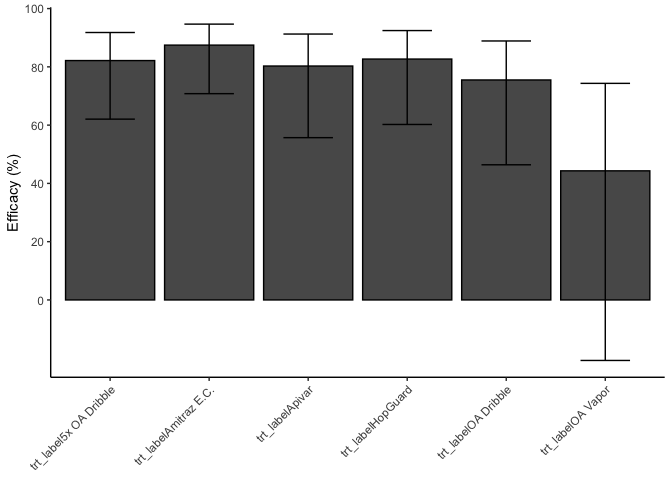
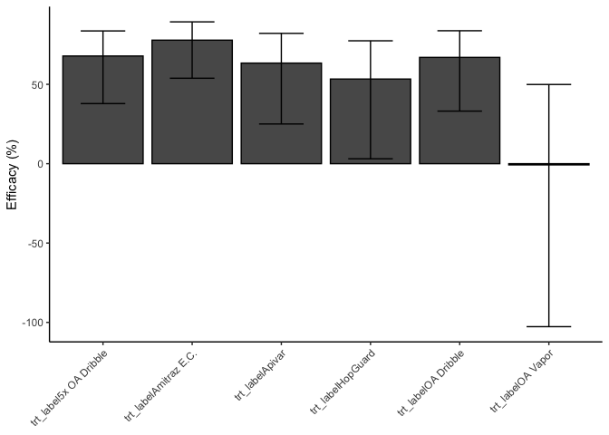
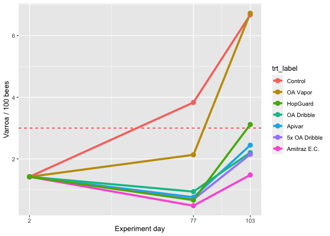

# Setup


```r
library(MASS)
library(tidyverse)
```

```
## ── Attaching packages ─────────────────────────────────────── tidyverse 1.3.2 ──
## ✔ ggplot2 3.4.1     ✔ purrr   1.0.1
## ✔ tibble  3.1.8     ✔ dplyr   1.1.0
## ✔ tidyr   1.3.0     ✔ stringr 1.5.0
## ✔ readr   2.1.4     ✔ forcats 1.0.0
## ── Conflicts ────────────────────────────────────────── tidyverse_conflicts() ──
## ✖ dplyr::filter() masks stats::filter()
## ✖ dplyr::lag()    masks stats::lag()
## ✖ dplyr::select() masks MASS::select()
```

```r
library(emmeans)
library(broom)
library(multcomp)
```

```
## Loading required package: mvtnorm
## Loading required package: survival
## Loading required package: TH.data
## 
## Attaching package: 'TH.data'
## 
## The following object is masked from 'package:MASS':
## 
##     geyser
```

```r
library(lme4)
```

```
## Loading required package: Matrix
## 
## Attaching package: 'Matrix'
## 
## The following objects are masked from 'package:tidyr':
## 
##     expand, pack, unpack
```

```r
library(lubridate)
```

```
## 
## Attaching package: 'lubridate'
## 
## The following objects are masked from 'package:base':
## 
##     date, intersect, setdiff, union
```

```r
library(mgcv)
```

```
## Loading required package: nlme
## 
## Attaching package: 'nlme'
## 
## The following object is masked from 'package:lme4':
## 
##     lmList
## 
## The following object is masked from 'package:dplyr':
## 
##     collapse
## 
## This is mgcv 1.8-41. For overview type 'help("mgcv-package")'.
```


# Read in data


```r
an_dat <- read.csv("./data_prepared/an_dat.csv")
```

# Prepare data for Varroa infestation analysis

Exclude any colonies that had EFB or queen issues or were removed due to weakness

```r
temp <- an_dat %>% 
  filter(efb == 0, failed + weak + QL + DL == 0) %>% 
  mutate(ch2_wash_bees = ch2_wash_workers + ch2_wash_drones + ch2_wash_queens,
         ch77_wash_bees = ch77_wash_workers + ch77_wash_drones + ch77_wash_queens,
         chpost_wash_bees = chpost_wash_workers + chpost_wash_drones + chpost_wash_queens,
         ch2_perc_var = 100*ch2_var_total/ch2_wash_bees,
         ch77_perc_var = 100*ch77_var_total/ch77_wash_bees,
         chpost_perc_var = 100*chpost_var_total/chpost_wash_bees
         )

# 117 of 177 colonies still in trial on d77: 66% of colonies. Not too bad.

names(temp)
```

```
##   [1] "X"                             "colony_num"                   
##   [3] "new_yard"                      "split_date"                   
##   [5] "parent_yard"                   "parent_id"                    
##   [7] "varroa_5cup"                   "splits_made"                  
##   [9] "stratum"                       "trt"                          
##  [11] "trt_numeric"                   "notes"                        
##  [13] "ch2_date"                      "ch2_var_tray"                 
##  [15] "ch2_var_wash"                  "ch2_var_total"                
##  [17] "ch2_var_total2"                "ch2_var_total_check"          
##  [19] "ch2_wash_workers"              "ch2_wash_drones"              
##  [21] "ch2_wash_queens"               "ch18_date"                    
##  [23] "ch18_qstatus"                  "ch18_notes"                   
##  [25] "ch18_eggs"                     "ch18_ageoldest"               
##  [27] "ch18_age"                      "ch30_date"                    
##  [29] "ch30_eggs"                     "ch30_qstatus"                 
##  [31] "ch30_notes"                    "ch30_ageoldest"               
##  [33] "ch30_age"                      "lay_18"                       
##  [35] "lay_30"                        "start_layday"                 
##  [37] "ch44_date"                     "ch44_eggs"                    
##  [39] "ch44_qstatus"                  "ch44_fob"                     
##  [41] "ch44_notes"                    "ch58_date"                    
##  [43] "ch58_eggs"                     "ch58_qstatus"                 
##  [45] "ch58_fob"                      "ch58_notes"                   
##  [47] "ch72_date"                     "ch72_eggs"                    
##  [49] "ch72_qstatus"                  "ch72_fob"                     
##  [51] "ch72_notes"                    "ch72_supered"                 
##  [53] "ch77_var_total"                "ch77_var_total2"              
##  [55] "ch77_var_total_check"          "ch77_wash_workers"            
##  [57] "ch77_wash_drones"              "ch77_wash_queens"             
##  [59] "ch77_lbs"                      "ch77_lbs2"                    
##  [61] "ch77_lbs_check"                "bottom_board"                 
##  [63] "supers_supering_sheet_dontuse" "chpost_date"                  
##  [65] "post_supers_use"               "post_lbs"                     
##  [67] "post_q_status"                 "post_quick_fob"               
##  [69] "post_notes"                    "chpost_var_total"             
##  [71] "chpost_var_total2"             "chpost_var_total_check"       
##  [73] "chpost_wash_workers"           "chpost_wash_drones"           
##  [75] "chpost_wash_queens"            "date_decided_remove"          
##  [77] "exp_day_decided_remove"        "reason_removal"               
##  [79] "ch77_qstatus"                  "ch77_efb"                     
##  [81] "trt_label"                     "efb_columns"                  
##  [83] "efb"                           "qstatuses"                    
##  [85] "failed"                        "weak"                         
##  [87] "QL"                            "DL"                           
##  [89] "died"                          "survived"                     
##  [91] "frames_bees"                   "frames_wbr"                   
##  [93] "frames_dbr"                    "frames_honey"                 
##  [95] "post_lbs_C"                    "ch2_wash_bees"                
##  [97] "ch77_wash_bees"                "chpost_wash_bees"             
##  [99] "ch2_perc_var"                  "ch77_perc_var"                
## [101] "chpost_perc_var"
```

```r
unique(temp$trt_label)
```

```
## [1] "Amitraz E.C."  "OA Dribble"    "HopGuard"      "Control"      
## [5] "OA Vapor"      "5x OA Dribble" "Apivar"
```

```r
temp <- temp %>%
  mutate(trt_label = fct_relevel(trt_label, "Control", "Apivar", "Amitraz E.C.", "OA Dribble",  "5x OA Dribble","OA Vapor", "HopGuard"))

# calculate the number of days between day 2 sampling and post sampling
temp <- temp %>% 
  mutate(
    num_days = mdy(chpost_date) - mdy(ch2_date),
    days_numeric = as.numeric(num_days)
  )

mean(unique(temp$days_numeric)) #102.75 ; round to 100
```

```
## [1] 102.75
```

```r
# pattern <- "date"
#   grep(pattern, names(temp), value=TRUE)  
```

# Run models for d77 varroa

## I would consider including yard as a random effect since we blocked by yard
This should increase power to detect treatment effects
But it gives a singular fit, so I will not use it as a random effect


```r
m1 <- glmer.nb(ch77_var_total~trt_label + ch2_var_total + (1|new_yard), data=temp)
```

```
## boundary (singular) fit: see help('isSingular')
```

```r
# singular
summary(m1)
```

```
## Generalized linear mixed model fit by maximum likelihood (Laplace
##   Approximation) [glmerMod]
##  Family: Negative Binomial(0.8545)  ( log )
## Formula: ch77_var_total ~ trt_label + ch2_var_total + (1 | new_yard)
##    Data: temp
## 
##      AIC      BIC   logLik deviance df.resid 
##    595.2    622.9   -287.6    575.2      107 
## 
## Scaled residuals: 
##     Min      1Q  Median      3Q     Max 
## -0.8898 -0.7553 -0.3246  0.3223  3.1681 
## 
## Random effects:
##  Groups   Name        Variance  Std.Dev. 
##  new_yard (Intercept) 5.844e-13 7.645e-07
## Number of obs: 117, groups:  new_yard, 4
## 
## Fixed effects:
##                        Estimate Std. Error z value Pr(>|z|)    
## (Intercept)             2.37905    0.29055   8.188 2.65e-16 ***
## trt_labelApivar        -1.65509    0.41721  -3.967 7.28e-05 ***
## trt_labelAmitraz E.C.  -2.16565    0.43870  -4.937 7.95e-07 ***
## trt_labelOA Dribble    -1.43262    0.40509  -3.537 0.000405 ***
## trt_label5x OA Dribble -1.81970    0.39467  -4.611 4.01e-06 ***
## trt_labelOA Vapor      -0.62478    0.39886  -1.566 0.117256    
## trt_labelHopGuard      -1.83896    0.42901  -4.287 1.81e-05 ***
## ch2_var_total           0.07098    0.01931   3.675 0.000238 ***
## ---
## Signif. codes:  0 '***' 0.001 '**' 0.01 '*' 0.05 '.' 0.1 ' ' 1
## 
## Correlation of Fixed Effects:
##             (Intr) trt_lA t_AE.C tr_OAD t_5OAD tr_OAV trt_HG
## trt_lblApvr -0.629                                          
## trt_lbAE.C. -0.615  0.423                                   
## trt_lblOADr -0.636  0.462  0.435                            
## trt_lbl5OAD -0.691  0.469  0.449  0.481                     
## trt_lblOAVp -0.663  0.467  0.443  0.482  0.492              
## trt_lblHpGr -0.600  0.436  0.411  0.453  0.454  0.455       
## ch2_var_ttl -0.284 -0.038  0.022 -0.083  0.049 -0.023 -0.078
## optimizer (Nelder_Mead) convergence code: 0 (OK)
## boundary (singular) fit: see help('isSingular')
```

```r
help('isSingular')
```

## Correcting for number of bees in sample by including it as an offset


```r
m2 <- glmer.nb(ch77_var_total ~ 
                 trt_label + 
                 ch2_perc_var + 
                 offset(log(ch77_wash_bees)) +
                 (1|new_yard), 
               data=temp)
```

```
## boundary (singular) fit: see help('isSingular')
```

```r
# summary(m2)
# Singular fit, still
# Omit random effect


m3 <- glm.nb(ch77_var_total ~ 
                 trt_label + 
                 ch2_perc_var + 
                 offset(log(ch77_wash_bees)), 
               data=temp)
# summary(m3)
summary(m3)
```

```
## 
## Call:
## glm.nb(formula = ch77_var_total ~ trt_label + ch2_perc_var + 
##     offset(log(ch77_wash_bees)), data = temp, init.theta = 0.8927878706, 
##     link = log)
## 
## Deviance Residuals: 
##     Min       1Q   Median       3Q      Max  
## -2.1012  -1.3533  -0.3665   0.3297   1.7329  
## 
## Coefficients:
##                        Estimate Std. Error z value Pr(>|z|)    
## (Intercept)            -3.55490    0.28239 -12.588  < 2e-16 ***
## trt_labelApivar        -1.62365    0.41092  -3.951 7.77e-05 ***
## trt_labelAmitraz E.C.  -2.07619    0.42998  -4.829 1.38e-06 ***
## trt_labelOA Dribble    -1.40645    0.39976  -3.518 0.000434 ***
## trt_label5x OA Dribble -1.72365    0.38863  -4.435 9.20e-06 ***
## trt_labelOA Vapor      -0.58540    0.39186  -1.494 0.135201    
## trt_labelHopGuard      -1.75298    0.42241  -4.150 3.33e-05 ***
## ch2_perc_var            0.20656    0.04972   4.154 3.27e-05 ***
## ---
## Signif. codes:  0 '***' 0.001 '**' 0.01 '*' 0.05 '.' 0.1 ' ' 1
## 
## (Dispersion parameter for Negative Binomial(0.8928) family taken to be 1)
## 
##     Null deviance: 191.04  on 116  degrees of freedom
## Residual deviance: 129.28  on 109  degrees of freedom
## AIC: 590.05
## 
## Number of Fisher Scoring iterations: 1
## 
## 
##               Theta:  0.893 
##           Std. Err.:  0.163 
## 
##  2 x log-likelihood:  -572.049
```


## How did the Varroa infestations vary between treatments on day 77?
Used to make statistical comparisons between treatment groups


```r
# Make a priori contrasts between pre
K <- contrMat(table(temp$trt_label), type="Tukey")
Ksub <- rbind(K[c(3,4,5,6,8,9,10,11,16,17),])

summary(glht(m3, linfct = mcp(trt_label = Ksub)),
        test = adjusted("single-step")) # Used for p-values for ESA poster
```

```
## 
## 	 Simultaneous Tests for General Linear Hypotheses
## 
## Multiple Comparisons of Means: User-defined Contrasts
## 
## 
## Fit: glm.nb(formula = ch77_var_total ~ trt_label + ch2_perc_var + 
##     offset(log(ch77_wash_bees)), data = temp, init.theta = 0.8927878706, 
##     link = log)
## 
## Linear Hypotheses:
##                                 Estimate Std. Error z value Pr(>|z|)    
## OA Dribble - Control == 0        -1.4065     0.3998  -3.518  0.00402 ** 
## 5x OA Dribble - Control == 0     -1.7237     0.3886  -4.435  < 0.001 ***
## OA Vapor - Control == 0          -0.5854     0.3919  -1.494  0.60360    
## HopGuard - Control == 0          -1.7530     0.4224  -4.150  < 0.001 ***
## OA Dribble - Apivar == 0          0.2172     0.4224   0.514  0.99361    
## 5x OA Dribble - Apivar == 0      -0.1000     0.4121  -0.243  0.99983    
## OA Vapor - Apivar == 0            1.0382     0.4149   2.503  0.09408 .  
## HopGuard - Apivar == 0           -0.1293     0.4437  -0.292  0.99958    
## 5x OA Dribble - OA Dribble == 0  -0.3172     0.4014  -0.790  0.95710    
## OA Vapor - OA Dribble == 0        0.8210     0.4035   2.035  0.26457    
## ---
## Signif. codes:  0 '***' 0.001 '**' 0.01 '*' 0.05 '.' 0.1 ' ' 1
## (Adjusted p values reported -- single-step method)
```

# Run models for post-honey Varroa
The 4 experimental blocks had a staggered start, but ended at the same time (due to the honey harvest )
To account for the different length of time that each yard was in the experiment, I include the number of days as a predictor, and make predictions normalized to ~103 days of experiment length.


```r
 pattern <- "bees"
   grep(pattern, names(temp), value=TRUE) 
```

```
## [1] "frames_bees"      "ch2_wash_bees"    "ch77_wash_bees"   "chpost_wash_bees"
```

```r
m4 <- glm.nb(chpost_var_total ~ 
                 trt_label + 
                 ch2_perc_var + 
               days_numeric +
                 offset(log(chpost_wash_bees)), 
               data=temp)

summary(m4)
```

```
## 
## Call:
## glm.nb(formula = chpost_var_total ~ trt_label + ch2_perc_var + 
##     days_numeric + offset(log(chpost_wash_bees)), data = temp, 
##     init.theta = 1.049780955, link = log)
## 
## Deviance Residuals: 
##     Min       1Q   Median       3Q      Max  
## -2.5327  -0.9993  -0.2571   0.2255   2.2654  
## 
## Coefficients:
##                         Estimate Std. Error z value Pr(>|z|)    
## (Intercept)            -7.003133   1.457561  -4.805 1.55e-06 ***
## trt_labelApivar        -1.004435   0.362248  -2.773 0.005558 ** 
## trt_labelAmitraz E.C.  -1.506269   0.367085  -4.103 4.07e-05 ***
## trt_labelOA Dribble    -1.107719   0.356745  -3.105 0.001902 ** 
## trt_label5x OA Dribble -1.134439   0.339760  -3.339 0.000841 ***
## trt_labelOA Vapor       0.007602   0.353832   0.021 0.982860    
## trt_labelHopGuard      -0.762087   0.365849  -2.083 0.037245 *  
## ch2_perc_var            0.098284   0.044712   2.198 0.027939 *  
## days_numeric            0.040790   0.014055   2.902 0.003705 ** 
## ---
## Signif. codes:  0 '***' 0.001 '**' 0.01 '*' 0.05 '.' 0.1 ' ' 1
## 
## (Dispersion parameter for Negative Binomial(1.0498) family taken to be 1)
## 
##     Null deviance: 186.15  on 116  degrees of freedom
## Residual deviance: 133.43  on 108  degrees of freedom
## AIC: 807.82
## 
## Number of Fisher Scoring iterations: 1
## 
## 
##               Theta:  1.050 
##           Std. Err.:  0.151 
## 
##  2 x log-likelihood:  -787.822
```

```r
m5 <- glm.nb(chpost_var_total ~ 
                 trt_label + 
                 ch2_perc_var + 
               # days_numeric +
                 offset(log(chpost_wash_bees)), 
               data=temp)

anova(m4, m5)
```

```
## Likelihood ratio tests of Negative Binomial Models
## 
## Response: chpost_var_total
##                                                                     Model
## 1                trt_label + ch2_perc_var + offset(log(chpost_wash_bees))
## 2 trt_label + ch2_perc_var + days_numeric + offset(log(chpost_wash_bees))
##       theta Resid. df    2 x log-lik.   Test    df LR stat.     Pr(Chi)
## 1 0.9660089       109       -796.4130                                  
## 2 1.0497810       108       -787.8224 1 vs 2     1 8.590558 0.003379104
```

```r
# More complex model favored p = 0.003; go with m4
```

## How did the Varroa infestations vary between treatments on day 103?
Used to make statistical comparisons between treatment groups


```r
# Make a priori contrasts between pre-selected
K <- contrMat(table(temp$trt_label), type="Tukey")
Ksub <- rbind(K[c(3,4,5,6,8,9,10,11,16,17),])

summary(glht(m4, linfct = mcp(trt_label = Ksub)),
        test = adjusted("single-step"))
```

```
## 
## 	 Simultaneous Tests for General Linear Hypotheses
## 
## Multiple Comparisons of Means: User-defined Contrasts
## 
## 
## Fit: glm.nb(formula = chpost_var_total ~ trt_label + ch2_perc_var + 
##     days_numeric + offset(log(chpost_wash_bees)), data = temp, 
##     init.theta = 1.049780955, link = log)
## 
## Linear Hypotheses:
##                                  Estimate Std. Error z value Pr(>|z|)   
## OA Dribble - Control == 0       -1.107719   0.356745  -3.105  0.01660 * 
## 5x OA Dribble - Control == 0    -1.134439   0.339760  -3.339  0.00744 **
## OA Vapor - Control == 0          0.007602   0.353832   0.021  1.00000   
## HopGuard - Control == 0         -0.762087   0.365849  -2.083  0.23987   
## OA Dribble - Apivar == 0        -0.103284   0.364493  -0.283  0.99963   
## 5x OA Dribble - Apivar == 0     -0.130004   0.348813  -0.373  0.99859   
## OA Vapor - Apivar == 0           1.012036   0.361794   2.797  0.04211 * 
## HopGuard - Apivar == 0           0.242348   0.374174   0.648  0.98157   
## 5x OA Dribble - OA Dribble == 0 -0.026720   0.343272  -0.078  1.00000   
## OA Vapor - OA Dribble == 0       1.115321   0.356273   3.131  0.01527 * 
## ---
## Signif. codes:  0 '***' 0.001 '**' 0.01 '*' 0.05 '.' 0.1 ' ' 1
## (Adjusted p values reported -- single-step method)
```


# Summarize efficacy
- And get confidence intervals around efficacy

## Day 77 Efficacy


```r
tidy(m3)
```

```
## # A tibble: 8 × 5
##   term                   estimate std.error statistic  p.value
##   <chr>                     <dbl>     <dbl>     <dbl>    <dbl>
## 1 (Intercept)              -3.55     0.282     -12.6  2.45e-36
## 2 trt_labelApivar          -1.62     0.411      -3.95 7.77e- 5
## 3 trt_labelAmitraz E.C.    -2.08     0.430      -4.83 1.38e- 6
## 4 trt_labelOA Dribble      -1.41     0.400      -3.52 4.34e- 4
## 5 trt_label5x OA Dribble   -1.72     0.389      -4.44 9.20e- 6
## 6 trt_labelOA Vapor        -0.585    0.392      -1.49 1.35e- 1
## 7 trt_labelHopGuard        -1.75     0.422      -4.15 3.33e- 5
## 8 ch2_perc_var              0.207    0.0497      4.15 3.27e- 5
```

```r
eff77 <- tidy(m3)

eff77_CI <- as.data.frame(confint(m3))
```

```
## Waiting for profiling to be done...
```

```r
eff77 <- cbind(eff77, eff77_CI)
eff77 <- eff77 %>% 
  rename(LCL = "2.5 %", UCL = "97.5 %")


eff77 <- eff77 %>% 
  mutate(times_as = exp(estimate),
         efficacy77 = 100*(1-times_as),
         
         times_as_UCL = exp(UCL),
         efficacy77_LCL = 100*(1-times_as_UCL),
         
         times_as_LCL = exp(LCL),
         efficacy77_UCL = 100*(1-times_as_LCL)
         )

eff77 <- eff77[2:7,]
```

## Day 103 Efficacy


```r
effpost <- tidy(m4)

effpost_CI <- as.data.frame(confint(m4))
```

```
## Waiting for profiling to be done...
```

```r
effpost <- cbind(effpost, effpost_CI)
effpost <- effpost %>% 
  rename(LCL = "2.5 %", UCL = "97.5 %")


effpost <- effpost %>% 
  mutate(times_as = exp(estimate),
         efficacypost = 100*(1-times_as),
         
         times_as_UCL = exp(UCL),
         efficacypost_LCL = 100*(1-times_as_UCL),
         
         times_as_LCL = exp(LCL),
         efficacypost_UCL = 100*(1-times_as_LCL)
         )

effpost <- effpost[2:7,]
```


## Plot d77 efficacy


```r
eff77 %>% 
  ggplot(aes(y = efficacy77, x = term), fill = "#031C38", alpha = 0.6) + 
  geom_bar(stat = "identity", color = "black") +
  geom_errorbar(aes(ymin=efficacy77_LCL, ymax=efficacy77_UCL), width=0.5) +
  
  ylab("Efficacy (%)") +
  scale_y_continuous(breaks = c(0,20,40,60,80,100)) +
  theme_classic() + # base_size = 30
  
  theme(axis.text.x=element_text(angle=45,hjust=1),  axis.title.x=element_blank())
```

<!-- -->
## Plot d103 efficacy


```r
effpost %>% 
  ggplot(aes(y = efficacypost, x = term), fill = "#031C38", alpha = 0.6) + 
  geom_bar(stat = "identity", color = "black") +
  geom_errorbar(aes(ymin=efficacypost_LCL, ymax=efficacypost_UCL), width=0.5) +
  
  ylab("Efficacy (%)") +
  # scale_y_continuous(breaks = c(0,20,40,60,80,100)) +
  theme_classic() + # base_size = 30
  
  theme(axis.text.x=element_text(angle=45,hjust=1),  axis.title.x=element_blank())
```

<!-- -->


Get predictions for day 77

```r
pred_77 <- emmip(m3, ~ trt_label, type = "response", CIs = TRUE, plotit = FALSE, offset = log(100))
# this is based on the non-included variable (Varroa infestation on day 2) being set to its mean... 
# Predictions are now set to the value of offset = 100... (mites per 100 bees)

pred_77$day <- 77

# Check this against the actual means per group
temp %>% 
  group_by(trt_label) %>% 
  summarise(varroa = mean(ch77_perc_var))
```

```
## # A tibble: 7 × 2
##   trt_label     varroa
##   <fct>          <dbl>
## 1 Control        3.97 
## 2 Apivar         0.882
## 3 Amitraz E.C.   0.510
## 4 OA Dribble     1.24 
## 5 5x OA Dribble  0.659
## 6 OA Vapor       2.32 
## 7 HopGuard       0.765
```

```r
# Matches closely
```

Get predictions for day 103


```r
pred_post <- emmip(m4, ~ trt_label, type = "response", CIs = TRUE, plotit = FALSE, offset = log(100))

pred_post$day <- 103
```


```r
# Combine day 2, 77, 103 into one plottable data frame

mean(temp$ch2_perc_var) # 1.42 Varroa per 100 bees
```

```
## [1] 1.417781
```

```r
pred_pre <- data.frame(pred_77$trt_label, yvar = c(rep(1.42, 7)), day = c(rep(2, 7)))
pred_pre <- pred_pre %>% 
  rename(trt_label = pred_77.trt_label)

  
  
# eff <- data.frame(eff77$term, eff77$efficacy77, effpost$efficacypost[1:8])
  
  

pred <- bind_rows(pred_pre, pred_77, pred_post)
```


# Graph Varroa infestation predictions


```r
pred %>% 
  ggplot(mapping = aes(y = yvar, x = day, colour = trt_label)) +
  geom_hline(yintercept = 3, linetype = 2, colour = "red") +
  geom_line(size = 1.5) +
  geom_point(size = 3) +

  scale_colour_manual(
  limits = c("Control", "OA Vapor", "HopGuard", "OA Dribble", "Apivar", "5x OA Dribble", "Amitraz E.C."),
  labels = c("Control", "OA Vapor", "HopGuard", "OA Dribble", "Apivar", "5x OA Dribble", "Amitraz E.C."),
  values = c("#F8766D", "#C49A00", "#53B400", "#00C094", "#00B6EB", "#A58AFF", "#FB61D7"), 
  aesthetics = "color") +
  
  scale_x_continuous(breaks = c(2, 77, 103)) +
  # ylim(0,8) +
  
  ylab("Varroa / 100 bees") +
  xlab("Experiment day")
```

```
## Warning: Using `size` aesthetic for lines was deprecated in ggplot2 3.4.0.
## ℹ Please use `linewidth` instead.
```

<!-- -->

```r
  # theme_classic(base_size = 30)
```


